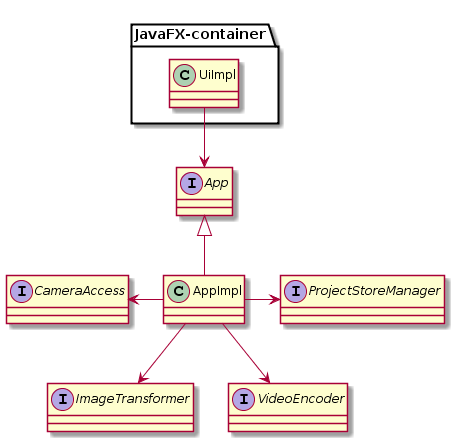

# dynamator
This is simple Java application that captures stills from your webcam and creates a video, so you can create your own stop-motion animations.  It is far from finished or polished.

# Instructions
For the moment, this will only work for Windows, and has only been tested on Windows 10.
The OpenCV and FFMpeg libraries used to access the camera or create videos are "difficult". Probably for perfectly valid reasons, they don't programmatically give up a lot of information about the underlying hardware or codecs.  As a result this may or may not work on your setup.  So before you invest a significant amount of time in creating a video, please test on your computer. 

## To Build
* Download and install the [Java 8 JDK](url "http://www.oracle.com/technetwork/java/javase/downloads/index.html").
* Download the Dynamator source from here.
* `cd dynamator` 
* `./gradlew build`

## To Run
* `./gradlew jfxRun`

# Why Dynamator (the name)
Dynamation was the name given to a form of stop-motion animation created by Ray Harryhausen, which he used to great effect in Jason and the Argonauts and other films.

# Why Dynamator (the motivation)
I wanted to experiment with various tools and software, and try out ideas about software design.
Ideas such as:
* Bob Martin's ideas about applications, components and interactors. Components conform to an interface that exposes their business functions.  The creation of components is separated from their business interface and only the main program knows how they were created.
* Using native libraries and building them into a Java application.  This uses [OpenCV](url "http://opencv.org/") via the [Javacpp project](url "https://github.com/bytedeco/javacpp").
* Classes relating to a component are collected together into a package. (Let's try to break the pattern of grouping classes together by function - controllers, views, etc.).  Package level scoping is used to hide everything other than the business interface to be used by other components, and the startup plumbing to be used by main.
* Google Guice as an injection framework.  Tried it, didn't really need it, so removed it again - but stole some ideas. 
* Where possible objects validate themselves.  In this code a null object reference is unexpected.  Where a reference is optional, then java.util.Optional is used.
* Read only domain model (as far as possible).  Annoyingly Java collections all have modification methods, so I wrote my own version of List called [Seq](url "definitions/src/main/java/type/Seq.java").
* Gradle instead of Maven.

# Design
 
